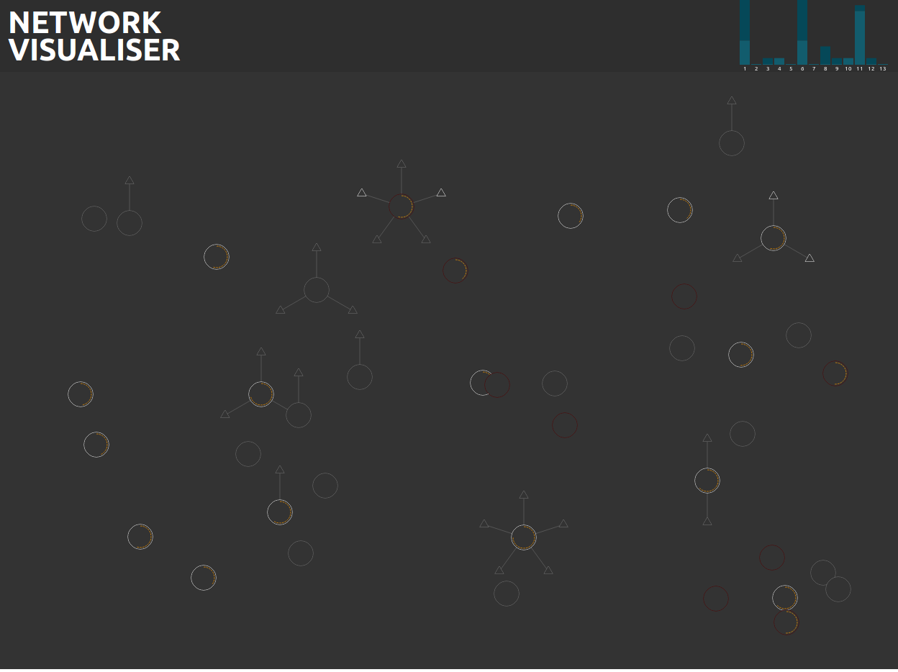

# Network Visualiser

A visual representation of a network

## Screen Shot


# Generators

## AirCrack NG

The network visualiser can use airodump-ng as it's source of data. This is the preferred generator as it will show access points along with all associated clients.

To run the Airodump generator run the following command:

```bash
node generators/aircrack/airodump.js <INTERFACE_NAME>
```

- Replace `<INTERFACE_NAME>` with the name of an interface in monitor mode. Most of the time this will be `wlan0mon`
- This must be run as root as it's accessing the device directly

## IW Scan

IW Scan is a much simpler data source that you probably already have installed however it is only capable of showing access points.

To run the IW Scan generator run the following command:

```bash
node generators/iwscan/iwscan.js <INTERFACE_NAME>
```

- Replace `<INTERFACE_NAME>` with the interface you want to scan.
- It's recommended to run this as root (`sudo node generators/iwscan/iwscan.js <INTERFACE_NAME>`), while it will still work you wont be able to do an active scan.