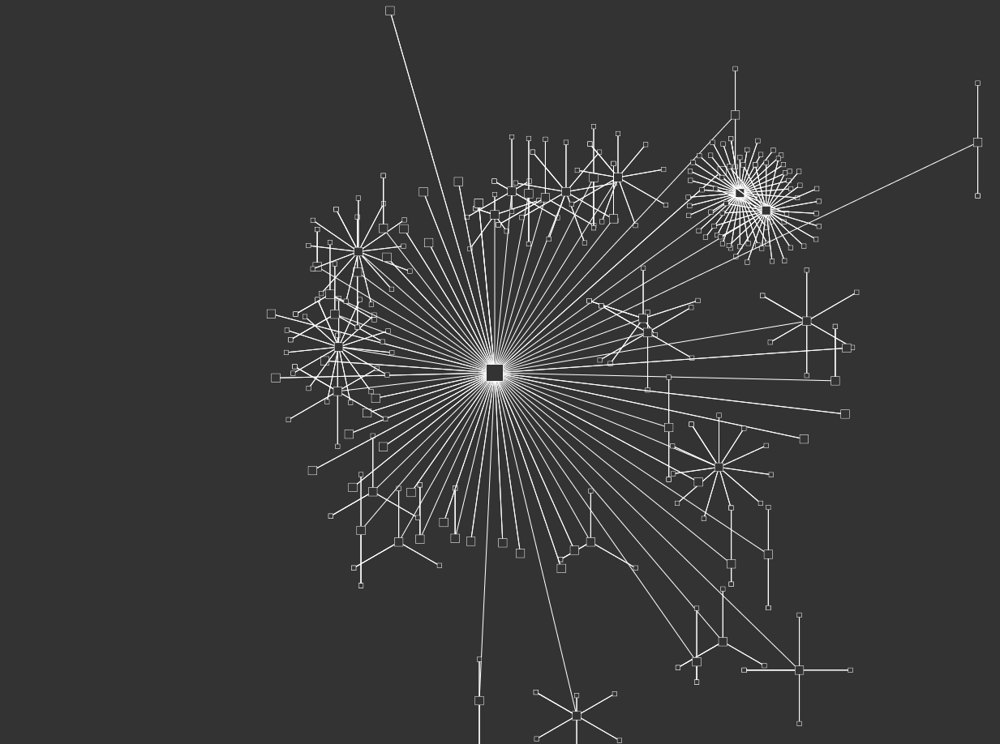

# Network Visualiser

A visual representation of a network

## Screen Shot


# Generators

## Airodump NG

The network visualiser can use data from airodump-ng as it's source of APs.
This is the preferred generator as it will also show all associated clients



### Running The Generator

To run the Airodump generator run the following commands in the `generators/airmon` directory

#### Start Running Airodump NG

```bash
airodump-ng -a -b g -w data --output-format csv --write-interval 1 mon0
```

Note: The `--write-interval 1` flag is only available with the latest version of Airodump NG, it can be omitted
with older versions you will just be limited to 30 second refresh times.


#### Run the file watcher

```bash
./parseCSV
```

#### Run the Node server

```bash
node airmon-parse.js
```