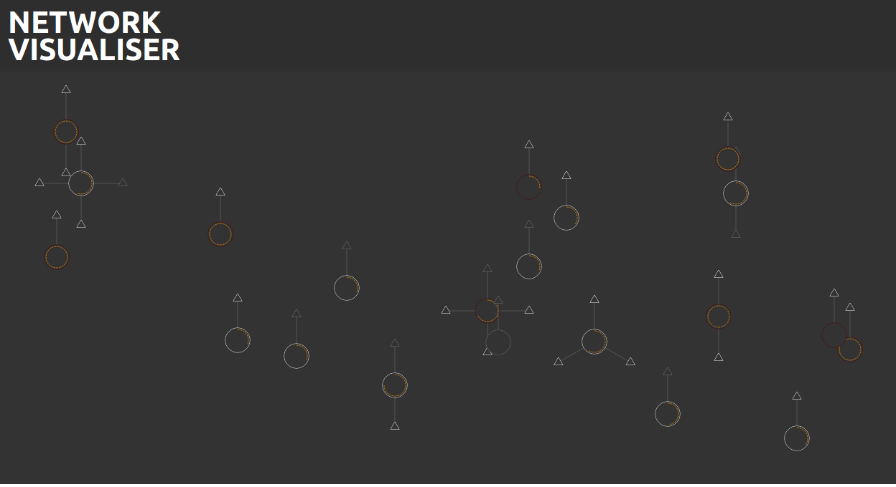

# Network Visualiser

A visual representation of a network

## Screen Shot


# Generators

## Airodump NG

The network visualiser can use data from airodump-ng as it's source of APs.
This is the preferred generator as it will also show all associated clients

To run the Airodump generator run the following commands in the `generators/airmon` directory

##### 1. Start Running Airodump NG

```bash
airodump-ng -a -b g -w data --output-format csv --write-interval 1 mon0
```

Note: The `--write-interval 1` flag is only available with the latest version of Airodump NG, it can be omitted
with older versions you will just be limited to 30 second refresh times.


##### 2. Run the file watcher

```bash
./parseCSV
```

##### 3. Run the Node server

```bash
node airmon-parse.js
```

## IW Scan

IW Scan is s simple easier to run data source but it will only show you APs

To run the IW Scan generator run the following commands in the `generators/iwscan` directory

##### 1.  Run the Node server

```bash
node iwscan.js wlan0
```

Notes:

- Replace wlan0 with the interface you want to scan.
- It's recommended to run is as root (`sudo`) else you wont be able to do an active scan.